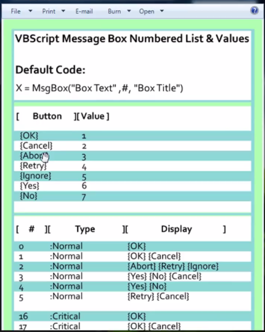
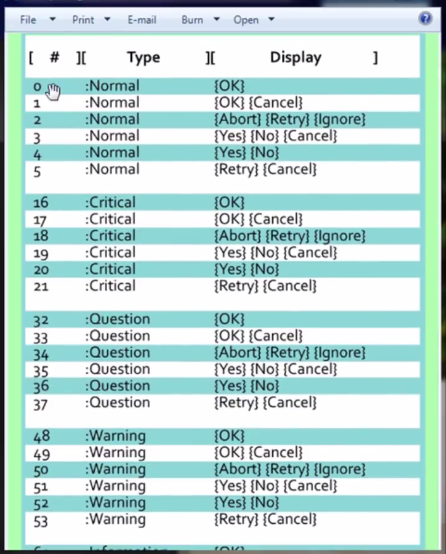
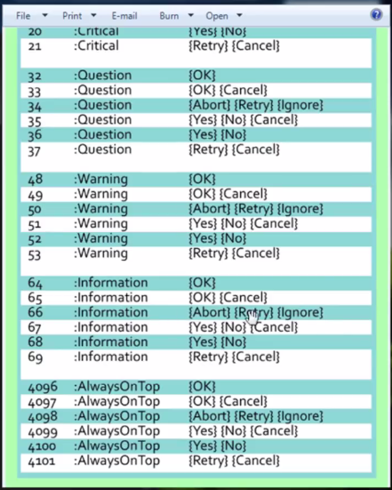
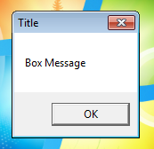
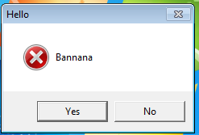
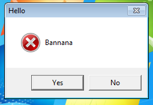
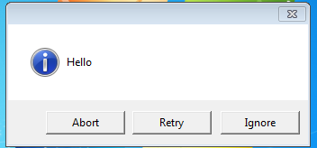
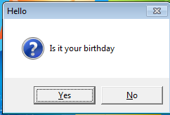
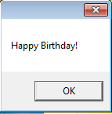
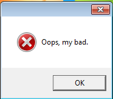

# Message Box Numbers (Msgbox)

## Dokumentasi







## Basic

```vbs
MsgBox "Box Message", Type, "Title"
```

## Contoh

```vbs
MsgBox "Box Message", 0, "Title"
```

> Hasil



```vbs
MsgBox "Banana", 20, "Hello"
```

> Hasil



```vbs
MsgBox "Bannana", 20, "Hello"
Msgbox "Hello", 66
```

> Hasil





---

```vbs
x = MsgBox("Is it your birthday", 36, "Hello")
if x = 6 then MsgBox "Happy Birthday!"
```



> jika diklik yes



```vbs
x = MsgBox("Is it your birthday", 36, "Hello")
if x = 6 then MsgBox "Happy Birthday!", 64
if x = 7 then MsgBox "Oops, my bad.", 16
```

> jika diklik no


