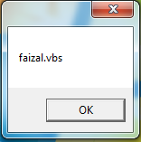
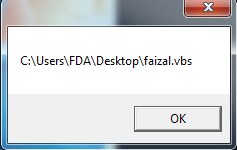
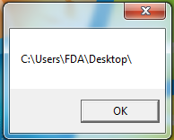
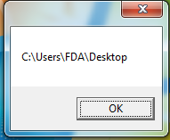
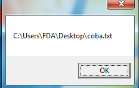

# Script Directory

## Basic

```vbs
WScript.ScriptName
WScript.ScriptFullName
```

## Example

```vbs
a = WScript.ScriptName
b = WScript.ScriptFullName

MsgBox a
MsgBox b
```

> Hasil :

-   WScript.ScriptName : mengetahui nama file
-   WScript.ScriptFullName : mengetahui letak folder dan nama file





## Mengetahui Nama File Dengan Left Right Len

```vbs
f = Left(WScript.ScriptFullName, (Len(WScript.ScriptFullName) - Len(WScript.ScriptName)))
MsgBox f
```



## Membuka File dalam folder sama

```vbs
f = Left(WScript.ScriptFullName, (Len(WScript.ScriptFullName) - Len(WScript.ScriptName)))

MsgBox f & "coba.txt"

CreateObject("wscript.shell").run f & "coba.txt"
```

## Menggunakan currentDirectory

```vbs
Option Explicit
dim objShell

set objShell = CreateObject("wscript.shell")

MsgBox objShell.CurrentDirectory
```



---

```vbs
Option Explicit
dim objShell

set objShell = CreateObject("wscript.shell")

MsgBox objShell.CurrentDirectory & "\coba.txt"
```



## Username Windows

```vbs
Option Explicit
dim objShell

set objShell = CreateObject("wscript.shell")

objShell.run "C:\Users\%username%\Desktop\coba.txt"
```
