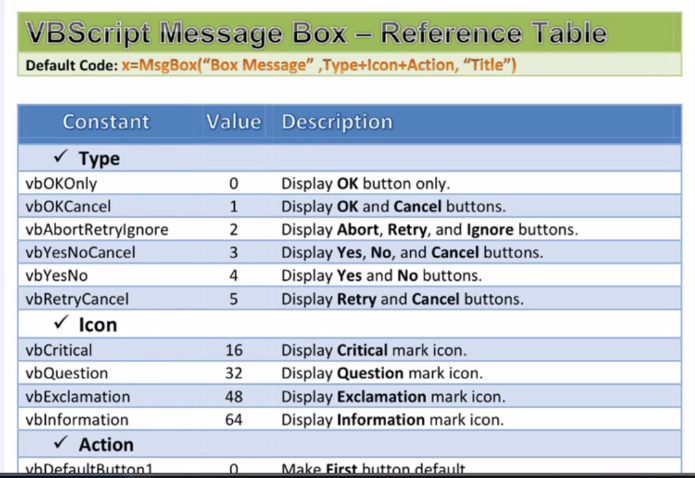
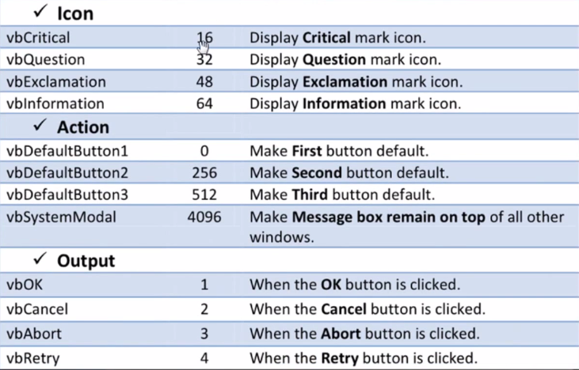
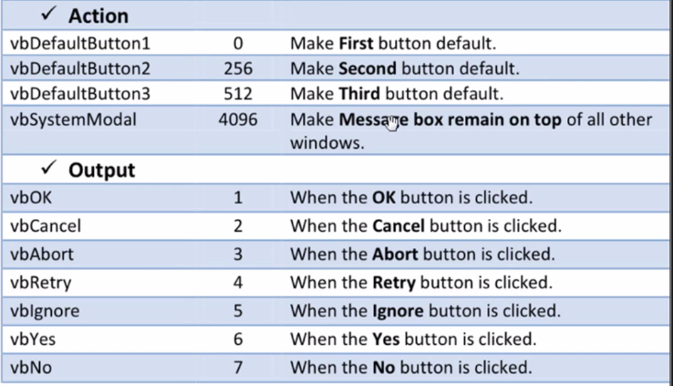
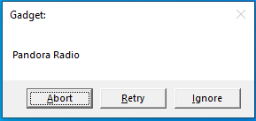
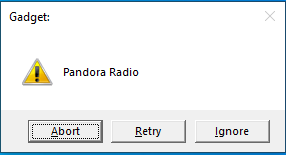
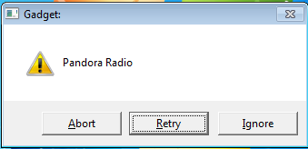
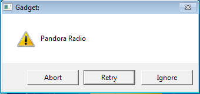
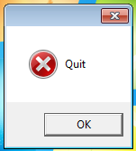

# Message Box Constants

## Dokumentasi







## Constant

```vbs
MsgBox "Pandora Radio", vbAbortRetryIgnore, "Gadget:"
```

> Hasil



## Icon

```vbs
MsgBox "Pandora Radio", vbAbortRetryIgnore + vbExclamation, "Gadget:"
```

> Hasil



## Action

```vbs
MsgBox "Pandora Radio", vbAbortRetryIgnore + vbExclamation + vbDefaultButton2, "Gadget:"
```



## Modal

```vbs
MsgBox "Pandora Radio", vbAbortRetryIgnore + vbExclamation + vbDefaultButton2 + vbSystemModal, "Gadget:"
```



## Output

```vbs
a = MsgBox("Pandora Radio", vbAbortRetryIgnore + vbExclamation + vbDefaultButton2 + vbSystemModal, "Gadget:")
if a = 3 then MsgBox "Quit", vbCritical
```

> ketika diklik Abort



## Memisahkan baris agar rapi

> Menggunakan \_ (underscore) diakhir kalimat

```vbs
a = MsgBox("Pandora Radio"_
, vbAbortRetryIgnore + vbExclamation + vbDefaultButton2 + vbSystemModal,_
"Gadget:")
```
