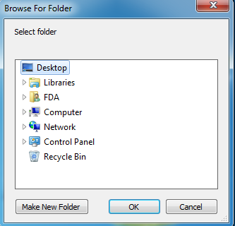
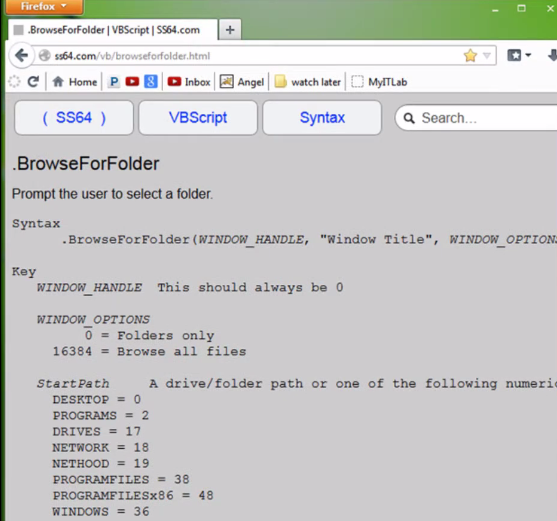
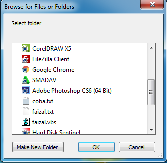
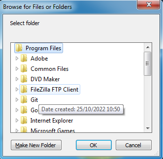
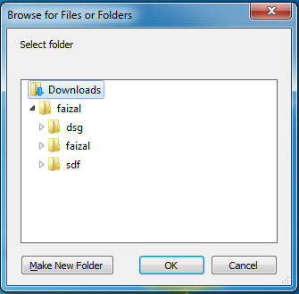
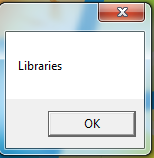
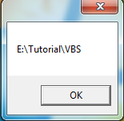
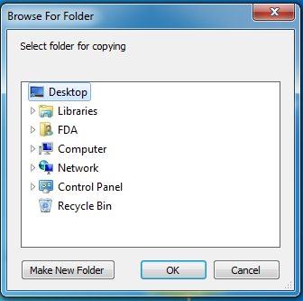

# Browse For Folder

## Situs Dokumentasi

> Link : [http://ss64.com](http://ss64.com)

## Example

```vbs
Option Explicit
dim objApp : set objApp = CreateObject("shell.application")
dim folder, path

set folder = objApp.BrowseForFolder(0, "Select Folder", 0, 0)
```

Hasil :



## Dokumentasi



## Example 16384

```vbs
Option Explicit
dim objApp : set objApp = CreateObject("shell.application")
dim folder, path

set folder = objApp.BrowseForFolder(0, "Select Folder", 16384, 0)
```

Hasil :



## Program File

```vbs
Option Explicit
dim objApp : set objApp = CreateObject("shell.application")
dim folder, path

set folder = objApp.BrowseForFolder(0, "Select Folder", 16384, 38)
```



## Sesuai Keinginan

```vbs
Option Explicit
dim objApp : set objApp = CreateObject("shell.application")
dim folder, path

set folder = objApp.BrowseForFolder(0, "Select Folder", 16384, "C:\Users\Program Is Fun\downloads")
```



## Mengambil Title

```vbs
Option Explicit
dim objApp : set objApp = CreateObject("shell.application")
dim objFolder, path

set objFolder = objApp.BrowseForFolder(0, "Select Folder", 0, 0)

if objFolder  is Nothing then
    MsgBox "Canceled"
    WScript.Quit
else
    MsgBox objFolder.title
end if
```

Hasil :



## Mengambil Pathnya

```vbs
Option Explicit
dim objApp : set objApp = CreateObject("shell.application")
dim objFolder

set objFolder = objApp.BrowseForFolder(0, "Select Folder", 0, 0)

if objFolder  is Nothing then
    MsgBox "Canceled"
    WScript.Quit
else
    MsgBox objFolder.self.path
end if
```

Hasil :



## Menggunakan Function

```vbs
Option Explicit
dim objApp : set objApp = CreateObject("shell.application")

Function selectFolder(Desc)
    set selectFolder = objApp.BrowseForFolder(0, Desc, 0, 0)

    if selectFolder  is Nothing then
        WScript.Quit
    end if
end Function

MsgBox selectFolder("Select folder for copying").self.path
```

Hasil :



## Copy File

```vbs
Option Explicit
dim objApp : set objApp = CreateObject("shell.application")

Function selectFolder(Desc)
    set selectFolder = objApp.BrowseForFolder(0, Desc, 0, 0)

    if selectFolder  is Nothing then
        WScript.Quit
    end if
end Function

selectFolder("Copy item here: ").copyHere "syiber.txt"
```

## Memindahkan Isi Folder

```vbs
Option Explicit
dim objApp : set objApp = CreateObject("shell.application")

Function selectFolder(Desc)
    set selectFolder = objApp.BrowseForFolder(0, Desc, 0, 0)

    if selectFolder  is Nothing then
        WScript.Quit
    end if
end Function

selectFolder("Copy item here: ").moveHere "syiber.txt"
```

## Memindahkan Isi Dalam Folder Ke Folder Lain

```vbs
Option Explicit
dim objApp : set objApp = CreateObject("shell.application")
dim file

Function selectFolder(Desc)
    set selectFolder = objApp.BrowseForFolder(0, Desc, 0, 0)

    if selectFolder  is Nothing then
        WScript.Quit
    end if
end Function

set file = selectFolder("Move items:").Items
selectFolder("Paste items: ").moveHere file
```

## Melihat Isi Folder 1 Per 1

```vbs
Option Explicit
dim objApp : set objApp = CreateObject("shell.application")
dim item

Function selectFolder(Desc)
    set selectFolder = objApp.BrowseForFolder(0, Desc, 0, 0)

    if selectFolder  is Nothing then
        WScript.Quit
    end if
end Function

for Each item in selectFolder("View Item").items
    MsgBox item.name
next
```
